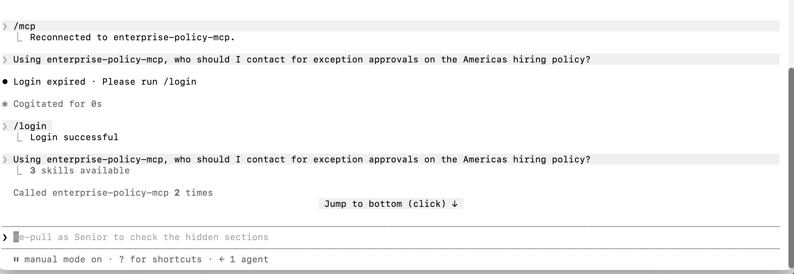
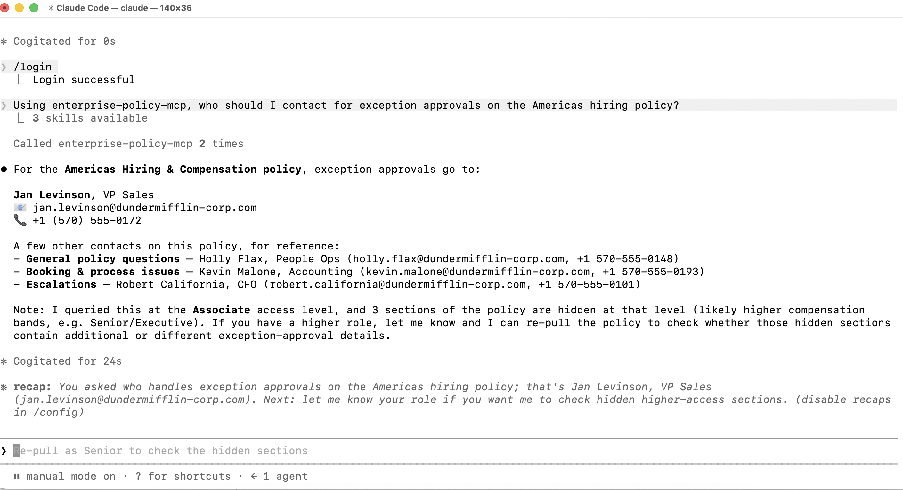

# DunderMifflin MCP Server

A Model Context Protocol (MCP) server that exposes permission-aware HR policy lookups as callable AI tools. Built as a hands-on exploration of the MCP protocol and enterprise-style access control, not a demo, a working system with a scored benchmark behind it.

## The problem

Enterprise policy data (hiring, travel, parental leave) often has role-specific sections, an Associate's compensation band and a CFO's compensation band living in the same document. A naive connector that serves the whole document to everyone leaks sensitive information. This project enforces access at the point of retrieval, not after the fact.

## What it does

Three tools, backed by 9 synthetic policy documents across 3 zones (Americas, APAC, Europe) and 3 topics (Hiring & Compensation, Travel, Parental Leave):

| Tool | Purpose |
|---|---|
| `list_policies` | Lists all available policies with zone, topic, and effective regions |
| `get_policy` | Retrieves a policy by ID, returning only the sections the caller's role is permitted to see |
| `check_access` | Checks whether a role can view a specific section, without returning its content |

Each policy section carries a `minRole` (`Associate`, `Senior`, or `Executive`). `get_policy` filters sections against the caller's role at retrieval time, an Associate calling `get_policy` on a hiring policy never receives the Executive compensation band in the response, it isn't fetched and then hidden, it's never returned at all.

## Live deployment

This server is deployed and publicly reachable at: https://enterprise-policy-mcp.onrender.com/mcp

Requires an API key, sent as an `x-api-key` header on every request. Reach out if you'd like a demo key to try it yourself.

**Note:** hosted on Render's free tier, which spins down after periods of inactivity. The first request after idle time may take 20-30 seconds to respond while it wakes back up.

## Architecture

- **Data**: `data/policies.json`, synthetic policy content, restructured from document-level to section-level role tagging (see Limitations for why)
- **Server**: `server.js`, built on the official `@modelcontextprotocol/sdk`, using Express and StreamableHTTP transport
- **Evaluation**: `eval/test-cases.json` + `eval.js`, a 39-case automated benchmark, run as an HTTP client against a running server instance

## Running it

```bash
git clone https://github.com/Ashutosh-nagaria/enterprise-policy-mcp.git
cd enterprise-policy-mcp
npm install
MCP_API_KEY=your-local-key node server.js
```

To test interactively with the MCP Inspector:

```bash
npx @modelcontextprotocol/inspector node server.js
```

## Running the evaluation suite

The server runs over HTTP, so the eval suite needs a running server to talk to. In one terminal:

```bash
MCP_API_KEY=your-local-key node server.js
```

In a second terminal, using the same key:

```bash
MCP_API_KEY=your-local-key npm test
```

(`npm test` runs `node eval.js`, which connects to `http://localhost:3000/mcp` by default; set `MCP_SERVER_URL` to point it elsewhere, e.g. at the live Render deployment.)

## Benchmark results

39/39 test cases passing, split across three buckets:

| Bucket | Cases | Passing | What it covers |
|---|---|---|---|
| Functional | 23 | 23 | Correct section counts and access decisions across all 9 policies, all 3 roles |
| Safety | 10 | 10 | Invalid roles, missing policies/sections, malformed input, missing required fields |
| Failure/fallback | 6 | 6 | Unknown tool calls, wrong data types, whitespace and empty-string edge cases |

## A bug the benchmark caught (in the eval, not the server)

The first run scored 31/39. All 8 failures were cases expecting the server to reject bad input. Debugging showed the server was correctly rejecting every one of them, the eval script was wrong, not the server: it assumed a rejected tool call would break the connection (throw an exception), but MCP returns validation failures as a normal, successful response with an `isError: true` flag inside it. The fix was checking that flag directly instead of assuming a dropped connection. Left here because it's a more honest signal-of-understanding than a clean-looking commit history.

## A second bug the benchmark caught (in the eval, again, after the HTTP migration)

When the server moved from stdio to StreamableHTTP transport (see Chapter 5 in CONCEPTS.md), the eval script still connected over stdio and silently hung instead of failing loudly. Fixed by rewriting `eval.js` to connect over the same StreamableHTTP transport the server actually runs, with the API key passed as a header, exactly the way a real client connects. Left here for the same reason as the first bug: a claim you can re-run and verify is worth more than one you can't.

## Known limitations

- **Exact-match lookups.** `policyId` and `sectionId` must match exactly, no fuzzy matching, no natural-language topic search, and no whitespace trimming (` americas-hiring ` with padding spaces will not match `americas-hiring`, this was caught and deliberately documented rather than fixed, see `X04` in the eval suite).
- **Case-sensitive IDs.** `AMERICAS-HIRING` will not match `americas-hiring`.
- **Manually role-tagged data.** Section-level `minRole` tags were assigned by hand based on the original document content, not derived automatically from any policy metadata standard.
- **Synthetic data only.** All 9 policies are fictional, generated for a fictional company (DunderMifflin Enterprises), no real organizational or personal data is used anywhere in this repo.

## Relationship to my other connector project

This project intentionally reuses the same underlying policy dataset as [enterprise-policy-connector](https://github.com/Ashutosh-nagaria/enterprise-policy-connector), a RAG-based semantic search system over the same documents. Same data, two different retrieval patterns: RAG for open-ended natural language questions, MCP tools for structured, permission-checked lookups. Worth comparing directly if evaluating both.

## Learn more

See [CONCEPTS.md](./CONCEPTS.md) for a full ELI5-to-PM-level explanation of every concept behind this project.

## Live demo: permission filtering in action

Connected to Claude Code and asked a policy question. Claude correctly identifies that it queried at the Associate access level, notes that sections are hidden, and offers to re-query at a higher role, demonstrating the permission-aware retrieval working in a real conversation, not just in test cases.





## License

MIT
